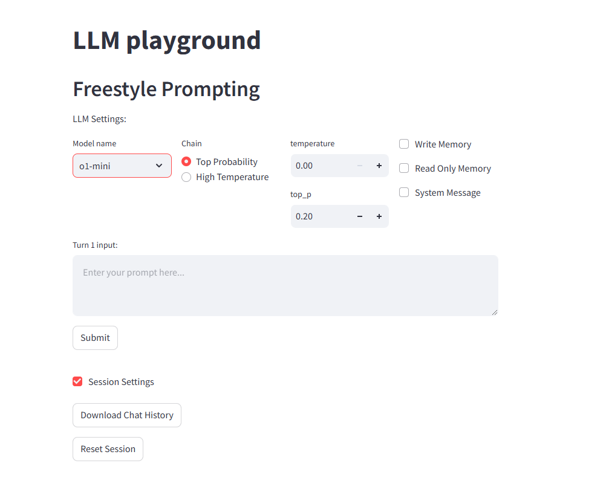

## Freestyle Prompting

Each user input passes directly to the model in all turns.

**The interface provides the following settings**:
- **model_names**: List of models available to respond to the user input
- **chain_type**: pre-set configuration values
- **temperature**: the temperature of the model
- **top_p**: the probabilistic sum of tokens that should be considered for each subsequent token
- **memory**: if the current turn will be saved in the chat history, default `False`
- **system_message**: if the current turn will implement a system instruction message, default `False`

**How the app manages the memory through the chat history**:
- The app saves all interactions
- When "Allow memory" is `True`, the input prompt adjusts with all the previous turns in which the "Allow memory" was set to `True`
- When the chat history is downloaded, all turns will appear with the corresponding metadata

**The current app does not have**:
- Dynamic chat interface
- Pre-built prompts
- Multi-turn configuration in a single step

**Current available models**: gpt-4o, gpt-4o-mini, o1-preview, o1-mini, develop-debugging (FakeChatModel)

**Interface Preview**:

